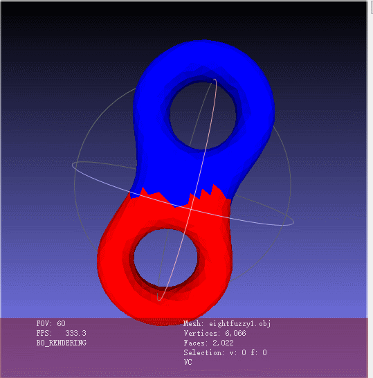

# Introduction
`Hierarchical Mesh Decomposition using Fuzzy Clustering and Cuts`
[项目地址](https://codechina.csdn.net/zaq15csdn/mesh-decomposition.git)
## 程序框架
### 依赖
最初计划是使用opengl展示出分割结果，但是展示功能为完成，所以只能查看原始模型。同时
依赖包括`opengl`的依赖。
+ glad
+ glfw
+ glm
+ assimp

[glfw cmake](https://www.glfw.org/docs/latest/build_guide.html#build_link_cmake_package)
[glad](https://github.com/Dav1dde/glad.git)
```python
pip install --user glad
```
### 编译/compile
使用`cmake`进行依赖管理
```
mkdir build&cd build
cmake ..
make -j4
```
### 执行
+ 查看模型
  ```
  ./OpenGLStart resources/objects/eight.uniform.obj 1
  ```
+ 产生分割结果
  ```
  ./OpenGLStart resources/objects/eight.uniform.obj
  ```
分割结果存为`obj文件+decompositionfuzzy.obj`,可以使用meshlab查看颜色。


### 库文件
+ `decomposition.h`: 最小路径库，包含`Decomposition`类，实现了`floyd`算法寻找图中任意两点之间的最小距离。实现了论文中关于`ang_distance`和`geo_distance`的计算。实现了关于面方向的选取与判断。
+ `netflow.h`: 网络流图库，包含`FordFulkerson`类，实现了FordFukerson在**无向图**中搜索最大流并返回从源开始的最小割切。使用二维数组处理无向图最大流问题，可以直接索引两个方向边，简化代码复杂度。

剩下几个图形库改编自learnopengl.com
+ `model.h`: 使用`assimp`加载模型，项目加入了是否合并三角面片对应的点的功能，因为在分割的时候需要考虑不同面片之间的点的重合关系，但是分割完成后需要渲染不同面片的颜色，此时每个面片都需要有独立的三个顶点。
+ `mesh.h`: 将对应的网格进行分割，调用了`decomposition.h`和`netflow.h`
## 测试结果

## 性能分析
面片数为n，由于使用了二维的数组简化编码难度，导致复杂度为O(n2)。对于面片数较少的模型，比如`8字形`模型中有2000面片，用时在2s左右。但是对于面片数较多的情况，性能下降严重，对于包含有69451`兔子模型`，用时接近20min。
## Assimp
assimp将obj中的face按照点的顺序加载进scene中，保存在nmesh里，一个obj对应一个mesh，其中有3*f个点
### face
f 723 965 762
f 259 755 665
f 333 523 952
f 164 1002 978
### vertice
v 0.410737 0.119391 -0.663529
v 0.413476 0.0874462 -0.725195
v 0.373414 0.12753 -0.727035
v 0.350091 0.0316636 -0.0699642
## Reference
https://www.inf.ufpr.br/pos/techreport/RT_DINF003_2004.pdf
